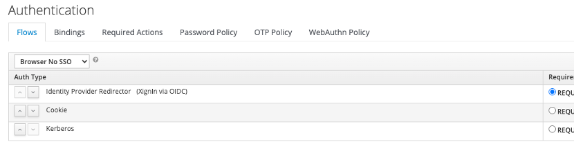

# Integration via XignIn Identity

## Integration via OpenID Connect Federation
Um XignIn Identity und XignIn zu integrieren, muss ein OpenID Connect Provider (IDP) erstellt werden

1. Melden Sie sich an der Verwaltungskonsole an
2. Wählen Sie aus dem Dropdown-Menü auf der oberen linken Seite den Bereich aus, in dem der IDP erstellt werden soll  
     
    

    
    

   
3. Wählen Sie die Option Identity Providers
4. Wählen Sie auf dem folgenden Bildschirm **OpenID Connect v1.0** im Dropdown-Menü
     
    

    
    

5. Konfigurieren Sie den Identity Provider, dies sind die obligatorischen Konfigurationsoptionen 
    a) Alias - Der Alias für den IdP, der intern von XignIn Identity verwendet wird 
    b) Authorization URL - Die URL, an die XignIn Identity den User-Agent sendet, um den Benutzer zu authentifizieren (z.B. https://xign.me/openid/authenticate) 
    c) Token URL - Die URL, von der XignIn Identity nach der Authentifizierung das Identitäts-Token abruft 
    d) Client ID - Die ID des XignIn Identity Clients im XignIn System (wird nach der Registrierung des Clients bei XignIn generiert) 
    e) Default Scopes - Die Scopes (d.h. die Benutzerattribute), die im Identitäts-Token enthalten sein sollen (setzen Sie den Wert auf Profil-E-Mail) 

### Set as default IDP

Die Einstellung von XignIn als Standard-IdP hat den Vorteil, dass unauthentifizierte Benutzer direkt zu XignIn weitergeleitet werden, andernfalls wird dem Benutzer eine Liste angezeigt, in der er aus allen konfigurierten IdPs auswählen muss.

Um XignIn als Standard-IdP zu konfigurieren, gehen Sie wie folgt vor: 

1.	Gehen Sie zu **Authentifizierung > Abläufe** und erstellen Sie eine Kopie des Browser-Ablaufs
2.	Öffnen Sie die Konfiguration des Identity Provider Redirector Auth Type, indem Sie **Actions > Config** wählen und Sie werden die folgende UI sehen
     
     
    

    
    

3.	Geben Sie unter **Standardidentitätsanbieter** den Namen des in den vorherigen Schritten erstellten OpenID Connect-Identitätsanbieters und einen Alias für diese Konfiguration ein und speichern Sie die Einstellungen
4.	Wenn die Einstellungen erfolgreich gespeichert wurden, wird der Identity Provider Redirector mit dem Alias versehen, der der Konfiguration zugewiesen wurde:
     
     
    

    
    

### Create User on first login

Der Identity Provider kann so konfiguriert werden, dass er automatisch einen xidentity-Benutzer anlegt, wenn er sich zum ersten Mal mit XignIn anmeldet (sofern er noch nicht existiert). Um dieses Verhalten zu konfigurieren, gehen Sie wie folgt vor:

1.	Gehen Sie zu **Authentifizierung > Flows** und kopieren Sie den Fluss First Broker Login
2.	Löschen Sie alle unnötigen Auth Types wie im folgenden Beispiel gezeigt, setzen Sie **User Creation Or Linking** als **REQUIRED** und **Create User If Unique** als **ALTERNATIVE**.
     
     
    

    
    

3.	Legen Sie den neu erstellten Fluss im Abschnitt **Erster Anmeldefluss** der IdP-Einstellungen fest
     
     
    

    
    

### Account mapping

Bei der ersten Authentifizierung über OpenID Connect wendet XignIn Identity folgende Logik auf den Prozess an:

KC prüft, ob ein Benutzer mit der gleichen E-Mail-Adresse existiert, die im Identity Token geliefert wird
1. Wenn ein Benutzer existiert, wird er/sie aufgefordert, sein/ihr Passwort einzugeben, um das Konto mit der von XignIn bereitgestellten Identität zu verknüpfen
2. Wenn es keinen bestehenden Benutzer gibt, wird ein neuer Benutzer erstellt und in XignIn Identity registriert, der mit der bereitgestellten Identität verknüpft wird (in diesem Fall wird die E-Mail-Adresse zum Benutzernamen des neu erstellten Benutzers)

### Redirect URI for XignIn
XignIn Identity has to be registered with XignIn prior to completing the configuration of the IdP. The Redirect URI, which has to be registered as well during the registration at XignIn will be of the form:

https://\<xidentity-host\>/auth/realms/\<realm-name\>/broker/oidc/endpoint

Die XignIn-Identität muss bei XignIn registriert werden, bevor die Konfiguration des IdP abgeschlossen wird. Der Redirect-URI, der bei der Registrierung bei XignIn ebenfalls registriert werden muss, hat die Form:
## Integration via XignIn Authentication SPI

### Configure Authentication Flow and Authentication Provider

XignSys bietet ein XignIn Identity Authentication SPI zur Integration von XignIn mit XignIn Identity. Um das Plugin zu verwenden, müssen Sie eine Organisation und einen Mandanten erstellen (siehe 1.3.3) und die folgenden Schritte durchführen:

1.	Gehen Sie zu Authentifizierung > Flows und kopieren Sie den Browser-Flow
2.	Löschen Sie den Knoten Forms
3.	Klicken Sie auf Ausführung hinzufügen und wählen Sie XignIn aus der Liste Anbieter und klicken Sie auf Speichern 
     
     
    

    
    

4.	Setzen Sie XignIn auf REQUIRED
5.	Konfigurieren Sie den XignIn-Anbieter, indem Sie auf Aktionen > Konfig klicken.
6.	Für die Konfiguration müssen Sie einige Informationen über die integrierte XignIn-Instanz und über Ihre XignIn-Identity-Instanz eingeben  
     
     
    

    
    

    * Alias - Ein Alias für die Konfiguration
    * Mapping-Attribut - Der Name des Claims der Authentifizierungsantwort von XignIn, der auf den xidentity-Benutzernamen abgebildet wird
    * Create User - Erzeugt einen xidentity-Benutzer, falls noch nicht vorhanden
    * JSON-Konfiguration - Der Inhalt der heruntergeladenen Konfigurationsdatei, die nach dem Erstellen eines Clients für Ihre Organisation verfügbar ist (WENN EIN CLIENT ERSTELLT WIRD, MUSS DIE REDIRECT-URL IN DER FORM https://\<xidentity-url\>/auth/realms/˙<realm-name˙>/login-actions/authenticate sein)

Nachdem die Ausführung erfolgreich konfiguriert wurde, können Sie den Authentifikator verwenden. Sie haben zwei Möglichkeiten: 

1.	Aktivieren Sie den Authentifikator für den gesamten Realm
2.	Aktivieren Sie den Authentifikator nur für bestimmte Clients

### Aktivieren für den gesamten Realm

Um den Authentifikator für den gesamten Realm zu aktivieren, müssen Sie die Browser-Bindung außer Kraft setzen. Gehen Sie zu Authentifizierung > Bindungen und wählen Sie den neu erstellten Fluss aus der Dropdown-Liste Browserfluss aus und klicken Sie auf Speichern.

### Für einen bestimmten Client aktivieren
Um den Authentifikator nur für einen bestimmten Client zu aktivieren, gehen Sie zu Clients und öffnen Sie die Einstellungen für den Client, für den Sie den Authentifikator aktivieren möchten. Scrollen Sie nach unten und erweitern Sie den Abschnitt Authentication Flow Overrides und wählen Sie den neu erstellten Flow aus der Dropdown-Liste Browser Flow und klicken Sie auf Speichern.