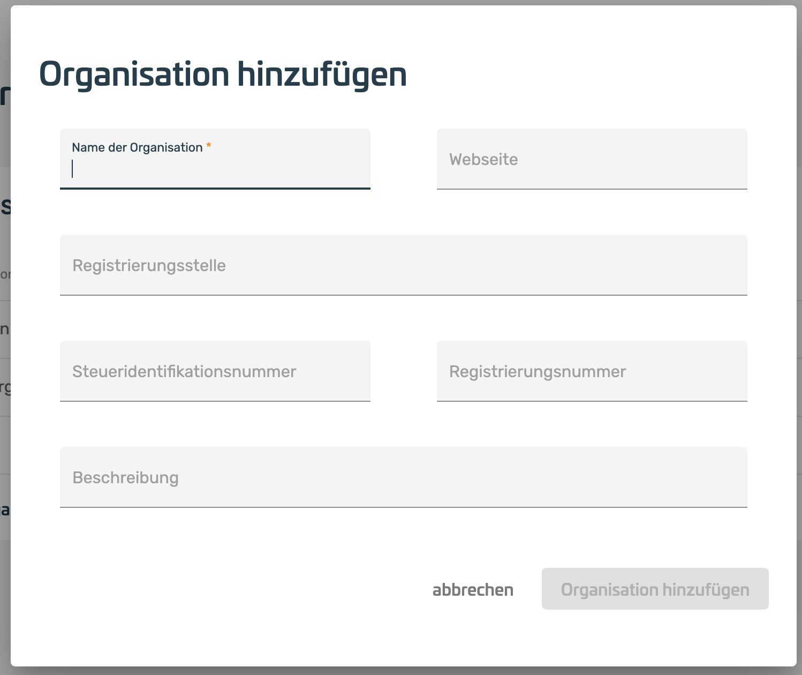
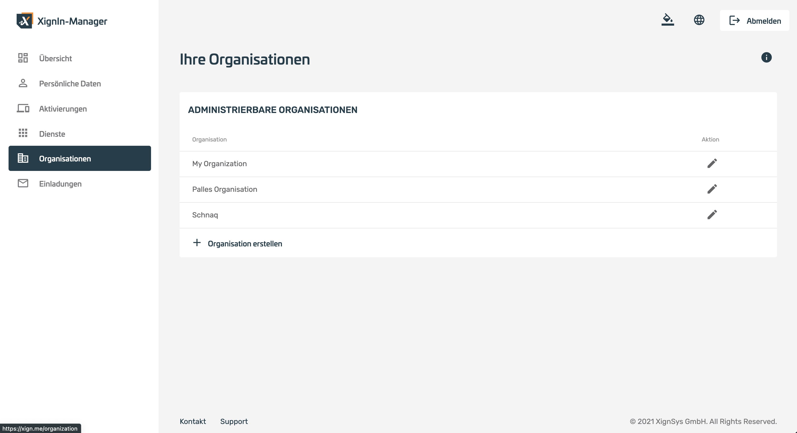
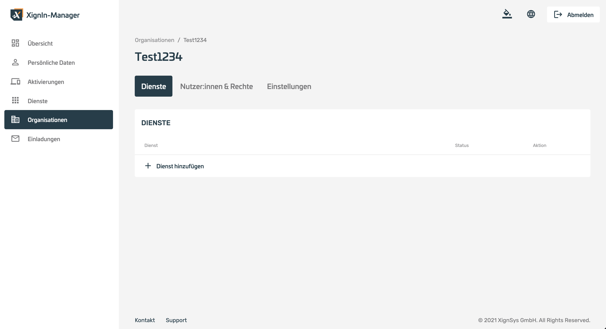
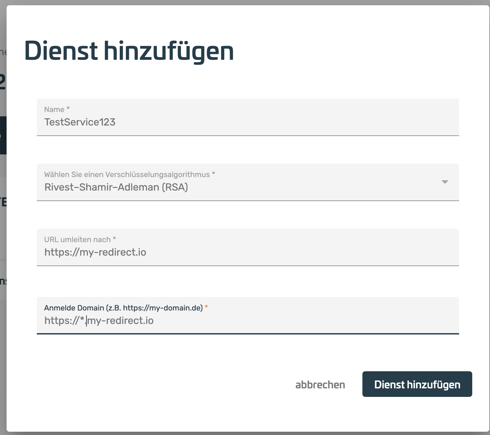
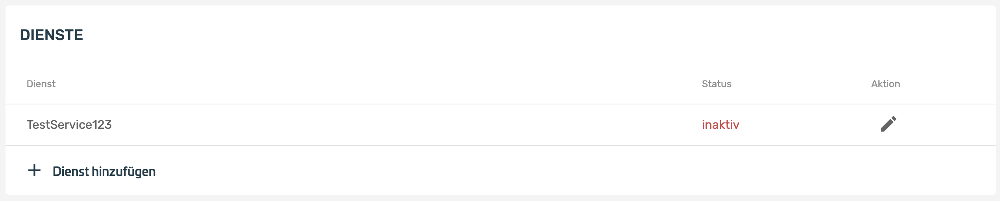
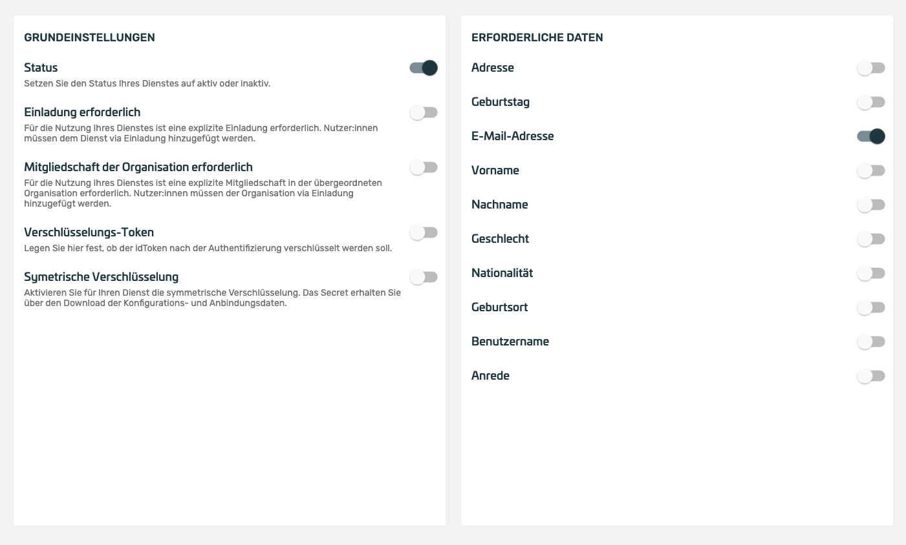
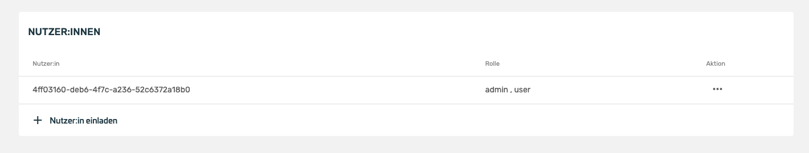
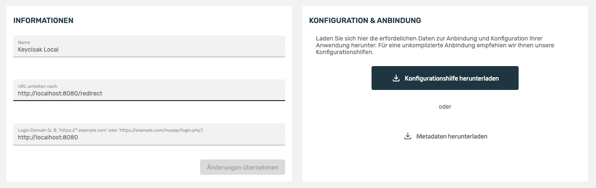

@autoHeader:1.1

# Dienste und Organisationen verwalten

Dienste werden in einer Organisationsstruktur angelegt. Dadurch können mehrere Dienste in einer Organisation zusammengefasst werden.

## Organisation erstellen

Für die Erstellung eines Dienstes im XignIn-Manager muss zuvor eine eigene Organisation angelegt werden:

1. Nach dem erfolgreichen Login am XignIn-Manager muss im linken Menü Organisation hinzufügen ausgewählt werden.

2. Daraufhin öffnet sich ein Formular, bei der Organisationsdaten angegeben werden können. Die notwendigen Felder sind mit dementsprechend (mit einem \*) markiert.

3. Nachdem die Organisation erstellt worden ist, kann sie über den Button bearbeiten bearbeitet werden.

 
 

4. Die Übersicht der Organisation zeigt verschiedene Einstellungsmöglichkeiten. Hier kann unter Dienste ein neuer Dienst hinzugefügt werden.

   

## Dienste hinzufügen & konfigurieren

Durch das Hinzufügen eines Dienstes, kann eine neue XignIn-Anbindung erzeugt werden.
Das Einbinden der XignIn Technologie basiert auf dem OpenId Connect Protokoll. Für diese Einbindung stehen verschiedene Bibliotheken von der XignSys GmbH oder OpenSource zur Verfügung.
Egal welche Lösung Sie nutzen (OpenId Connect, oder eine XignSys GmbH Lösung), die folgenden Schritte sind notwendig, um im XignIn-Manager eine Konfiguration für Ihren Dienst zu erstellen.
Nach dem Bestätigen des „Dienst hinzufügen“-Buttons öffnet sich ein Dialog.

1. Der Dialog zeigt ein Formular, dass mit den entsprechenden Angaben gefüllt werden muss, um den Dienst initial zu konfigurieren

 
 

- **Name**:  
  Ein Name für die Identifizierung.
- **Verschlüsselungsalgorithmus**:  
  Der Verschlüsselungsalgorithmus gibt den Algorithmus für die Verschlüsselung des OpenID Connect Tokens an, der nach der Authentifizierung vom Server abgerufen werden kann. Dieser Token beinhaltet die Informationen des Users, der sich authentifiziert hat (u.a. ein sub, der eine eindeutige MappingId des Users für den Dienst darstellt),
- **URL umleiten nach**:  
  Die hier angegebene URL wird aufgerufen, nachdem die Authentifizierung erfolgreich durchgeführt worden ist. Der Browser erhält diese URL als Antwort, wenn der QR-Code erfolgreich, zur Authentifizierung eines Users, genutzt wurde. Sie entspricht dem redirect_uri Parameter einer OpenId Connect Implementierung.
- **Anmelde Domain**:  
  Die Anmelde Domain gibt den Ursprung der QR-Code Anfrage an. Der Server akzeptiert Anfragen für den Dienst nur von der angegeben Domain. Typischerweise wird hier die Domain angegeben, über die ein Login durchgeführt werden soll.
  Ein Wildcard Support wird unterstützt, so kann z.B. die Anmelde Domain https://\*.example.de angegeben werden, um auf den folgenden Domains ein Login durchzuführen: https://dienstA.example.de oder https://dienstB.example.de.

2. Wenn der Dienst erfolgreich erstellt ist, dann wird er wie folgt angezeigt. Über den bearbeiten (Stift) Button kann der Dienst konfiguriert werden.

 
 

3. In der Bearbeitungsansicht kann der Dienst konfiguriert werden:

 
 

- **Informationen**:  
  Hier können die Informationen die bei der Erstellung des Dienstes angegeben wurden abgeändert werden. (Die einzige Ausnahme ist das Schlüsselmaterial, welches nicht anschließend geändert werden kann)
- **Konfiguration und Anbindung**:  
  Über Metadaten herunterladen kann die Dienst-Konfiguration als ZIP-Datei, in der alle wichtigen Informationen für das Entschlüsseln des OpenId Connect Tokens enthalten sind, heruntergeladen werden. Die Daten sind vertraulich zu behandeln.

4. Über den Reiter Nutzer:innen können die Nutzer des jeweiligen Dienstes konfiguriert werden. Wenn der Punkt Einladung erforderlich aktiviert ist, müssen hier die jeweiligen Nutzer des Dienstes eingeladen werden, damit sie sich bei dem Dienst anmelden können.

   
   

**Einladung versenden**:  
Über den Button Nutzer:in einladen kann eine Einladung per E-Mail versendet werden, die den Eingeladenen direkt Zugang zu diesem Dienst gewährt. Bevor der Eingeladene Zugang zu dem Dienst erhalten kann, muss dieser die Einladung akzeptieren. Das kann auf verschiedene Arten passieren:

- Der Eingeladene hat bereits einen XignIn-Account mit der eingeladenen E-Mail-Adresse
  - Dann bekommt der Eingeladene eine E-Mail mit einer Nachricht, in der er über die Einladung zu einem neuen Dienst informiert wird.
  - Der Eingeladene meldet sich im XignIn-Manager an und akzeptiert die Einladung.
  - Im Anschluss ist der Account mit dem Dienst verbunden.
- Der Eingeladene hat bereits einen XignIn-Account mit einer anderen E-Mail-Adresse
  - Es wird eine komplette Registrierungsmail an die angegebene E-Mail-Adresse versendet, da im XignIn-Manager diese Adresse noch nicht bekannt ist.
  - Der Eingeladene scannt mit seiner bereits aktivierten App den neu erhaltenen QR-Code über die eingeladene E-Mail-Adresse und gibt die PIN ein. Damit bestätigt er den Besitz dieser „neuen“ E-Mail-Adresse und fügt diese E-Mail seinem Account hinzu.
  - Danach wird der Eingeladene automatisch dem Dienst hinzugefügt.
- Der Eingeladene hat KEINEN XignIn-Account:
  - Es wird eine komplette Registrierungsmail an die angegebene E-Mail-Adresse versendet, da im XignIn-Manager diese Adresse noch nicht bekannt ist.
  - Der Eingeladene erstellt sich mit der Registrierungsmail, die er erhalten hat, einen neuen XignIn-Account.
  - Danach wird der Eingeladene automatisch dem Dienst hinzugefügt.

**Dienstmitgliedschaft bearbeiten**:  
Über die Nutzerübersicht können über den Punkt _Aktion_ die Rechte sowie die Rollen des jeweiligen Nutzers konfiguriert werden.

5. Weitere Konfiguration des Dienstes:

 
 

- **Allgemein**:  
  Die Einstellung von der Erstellung des Clients können hier geändert werden. Der Verschlüsselungsalgorithmus kann NICHT geändert werden.
- **Status**:  
  Wenn der Dienst genutzt werden soll, so muss er hier aktiviert werden.
- **Einladung erforderlich**:  
  Es können sich nur Benutzer an dem Dienst authentifizieren, wenn sie zuvor zu dem Dienst eingeladen wurden. Das heißt sie müssen in der Dienstmitgliedschaft auftauchen mit ihren Accounts, bevor sie sich anmelden können. Hierdurch kann verhindert werden, dass XignIn Benutzer den Authentifizierungs-QR-Code scannen können, die NICHT zu dem Dienst gehören. Um Benutzer zu dem Dienst hinzuzufügen, müssen diese über 2.3) Einladung versenden eingeladen werden.
- **Organisationsmitgliedschaft vorausgesetzt**:  
  Die Benutzer, die sich gegen diesen Dienst authentifizieren dürfen, MÜSSEN in der Organisation, die den Dienst besitzt, bereits Mitglied sein (über eine Einladung können Benutzer der Organisation hinzugefügt werden).
- **Verschlüsselungs-Token**:  
  Nach einer erfolgreichen Authentifizierung wird der abrufbare OpenID Connect Token verschlüsselt und signiert. Falls der Token NUR signiert werden soll, so kann die Verschlüsslung hier deaktiviert werden.
- **Symmetrische Verschlüsselung**:  
  Neben den Asymmetrischen Verschlüsselung kann auch eine symmetrische Verschlüsselung aktiviert werden.
- **Erforderliche Daten**:  
  Bestimmt welche Daten im Consent-Screen der App angezeigt und an den Dienstanbieter übertragen werden
